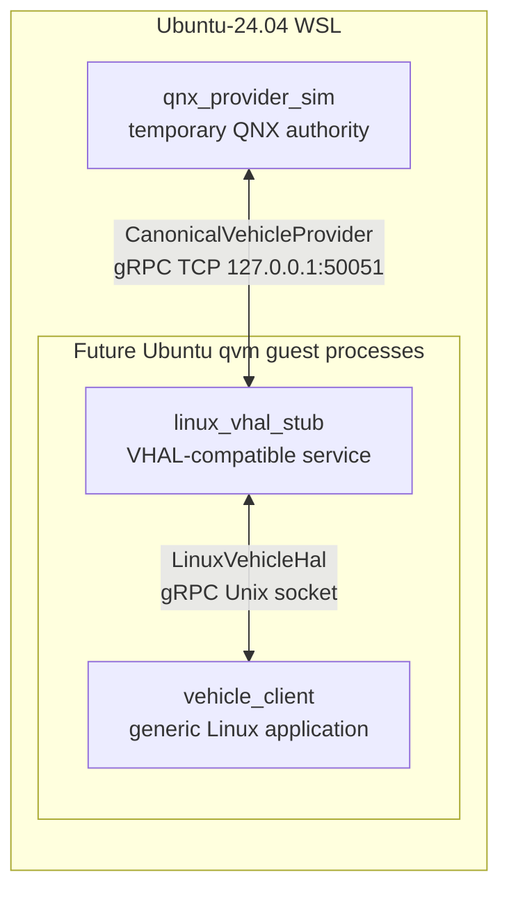
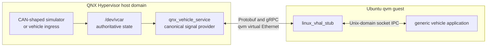
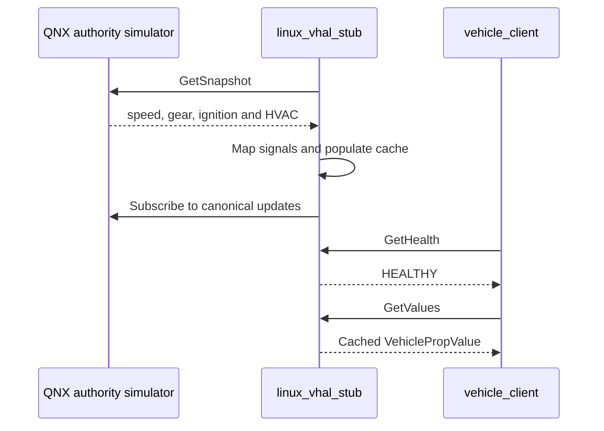
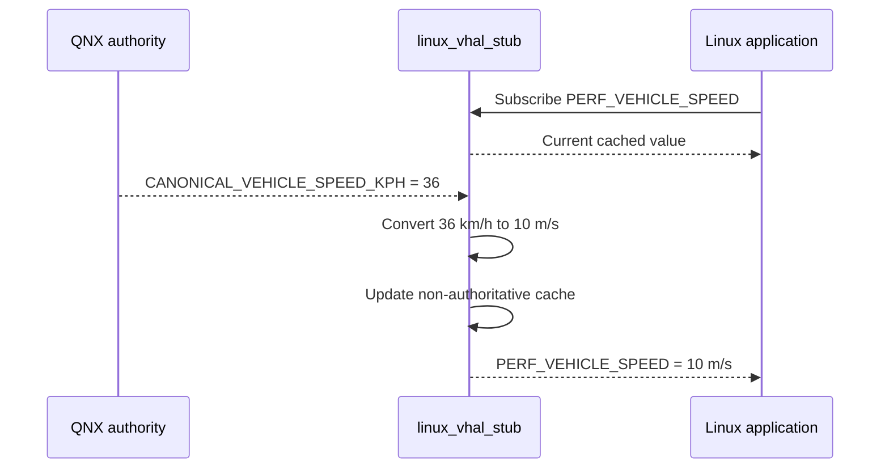
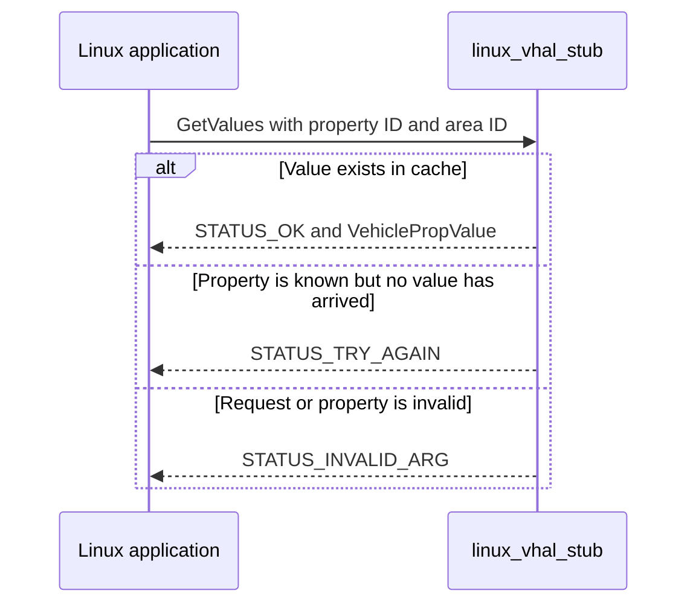
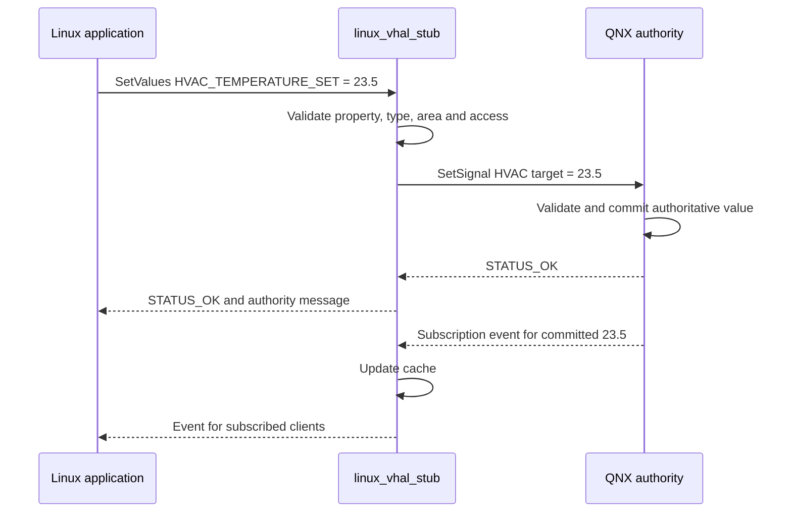
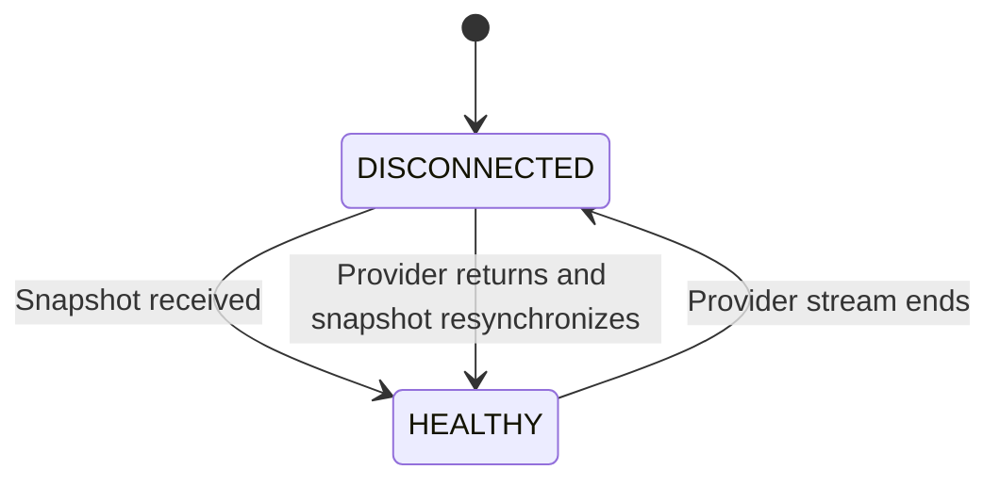

# Linux VHAL-compatible property service

This component demonstrates an Android Vehicle HAL-shaped property flow without
requiring Android Automotive OS. It runs natively on Linux, receives canonical
vehicle signals from a QNX-side authority, maps them to Android-compatible
vehicle properties, and exposes those properties to ordinary Linux applications
through local IPC.

It is a **VHAL-compatible integration service**, not an Android Binder HAL. The
property identifiers and behavior follow AOSP, while the process boundaries use
portable Protobuf and gRPC.

## What it demonstrates

- separation between an authoritative vehicle controller and a consumer guest
- initial vehicle-state synchronization
- canonical-signal-to-VHAL-property mapping
- Android-compatible property IDs, areas, access modes, change modes and units
- batched `GetValues` and `SetValues` operations
- continuous and on-change subscriptions
- server-streamed property events
- read-only and writable-property validation
- QNX-authoritative write acknowledgement
- provider health and reconnection
- Linux-native IPC over a Unix-domain socket

It does not implement Android Binder, Car Service, VINTF, Android SELinux HAL
policy, an Android application or a graphical dashboard.

## Topology

### Current WSL development topology

All three executables currently run in the selected `Ubuntu-24.04` WSL
distribution. `qnx_provider_sim` temporarily represents the future QNX host.



### Intended QNX Hypervisor topology

When the QNX side is implemented, only `qnx_provider_sim` is replaced. The VHAL
stub and its application-facing interface remain unchanged.



QNX remains the only authority. `linux_vhal_stub` holds a non-authoritative
cache so guest applications can read and subscribe to the latest received
properties.

## Executable roles

| Executable | Role |
| --- | --- |
| `qnx_provider_sim` | Temporary QNX authority. Owns canonical values, publishes a changing speed signal, validates HVAC commands and publishes committed changes. It will later be replaced by `qnx_vehicle_service`. |
| `linux_vhal_stub` | Guest-side service. Fetches the initial provider snapshot, consumes updates, maps canonical signals to VHAL properties, stores the guest cache and serves local clients. |
| `vehicle_client` | Example generic Linux application. Lists configurations, reads properties, requests writes, subscribes to events and checks provider health. |

The build creates native Linux ELF executables under `build/`. Linux
executables do not use a `.exe` suffix.

## Interfaces

The shared contract is
[`proto/linux_vehicle_hal.proto`](proto/linux_vehicle_hal.proto).
It declares two services with deliberately separate responsibilities.

### Remote provider interface: `CanonicalVehicleProvider`

This represents the QNX-to-guest boundary:

- `GetSnapshot` returns complete initial vehicle state.
- `Subscribe` streams authoritative canonical signal changes.
- `SetSignal` submits a write request and returns the authority's result.

The simulator listens on `127.0.0.1:50051`. In the qvm deployment this becomes
the QNX host address on qvm virtual Ethernet.

### Local application interface: `LinuxVehicleHal`

This represents native IPC inside the Ubuntu guest:

- `GetAllPropConfigs` returns implemented property metadata.
- `GetValues` performs batched cached reads.
- `SetValues` performs batched authoritative write requests.
- `Subscribe` streams selected property events.
- `GetHealth` reports whether the QNX provider is connected.

It listens on this Unix-domain socket:

```text
/tmp/virtual-sdv-vhal.sock
```

## Supported properties

A real VHAL advertises only properties implemented by the vehicle. It does not
need to implement every property defined by Android.

| Property | AOSP ID | Access | Change mode | Unit and area |
| --- | --- | --- | --- | --- |
| `PERF_VEHICLE_SPEED` | `0x11600207` | Read | Continuous | m/s, global |
| `GEAR_SELECTION` | `0x11400400` | Read | On change | `VehicleGear`, global |
| `IGNITION_STATE` | `0x11400409` | Read | On change | `VehicleIgnitionState`, global |
| `HVAC_TEMPERATURE_SET` | `0x15600503` | Read/write | On change | degC, row-one-left seat |

Canonical QNX speed is expressed in km/h. The VHAL stub converts it to m/s as
required by AOSP `PERF_VEHICLE_SPEED`.

## Complete property flows

### Startup and initial synchronization

The VHAL stub may start before the provider, but its health remains
`DISCONNECTED` and reads return `STATUS_TRY_AGAIN` until a snapshot arrives.



### Provider update and application subscription



### Cached read flow



Reads use the latest authoritative value already received into the guest cache;
they do not synchronously query QNX.

### Writable HVAC flow

The stub never commits an HVAC value locally. The request travels to the
authority and only the committed provider update changes the guest cache.



Writes to speed, gear or ignition return `STATUS_ACCESS_DENIED`. HVAC values
outside 16–30 °C return `STATUS_INVALID_ARG`.

### Provider loss and recovery



The service retries once per second. The current cache is retained while the
provider is disconnected; explicit stale-value marking is a future improvement.

## Build

The tested environment is the non-default WSL distribution `Ubuntu-24.04`.

Install dependencies:

```bash
sudo apt install g++ make pkg-config protobuf-compiler \
    protobuf-compiler-grpc libprotobuf-dev libgrpc++-dev
```

Build from an `Ubuntu-24.04` shell after changing to wherever this standalone
folder is located:

```bash
cd /path/to/vhal_stub
make
```

From PowerShell, start the selected distribution and build from the folder's
WSL path:

```powershell
wsl -d Ubuntu-24.04
cd /path/to/vhal_stub
make
```

Normal output is concise. Use `make V=1` to display complete compiler and linker
commands. Use `make clean` to remove generated code, objects and executables.

## Run manually

Use three `Ubuntu-24.04` terminals.

Terminal 1 — temporary authority:

```bash
cd /path/to/vhal_stub
./build/qnx_provider_sim
```

Terminal 2 — VHAL-compatible service:

```bash
cd /path/to/vhal_stub
./build/linux_vhal_stub
```

Terminal 3 — generic application:

```bash
cd /path/to/vhal_stub

./build/vehicle_client health
./build/vehicle_client configs
./build/vehicle_client get PERF_VEHICLE_SPEED
./build/vehicle_client get HVAC_TEMPERATURE_SET
./build/vehicle_client set HVAC_TEMPERATURE_SET 23.5
./build/vehicle_client subscribe PERF_VEHICLE_SPEED
```

Example subscription output:

```text
PERF_VEHICLE_SPEED area=0 value=10 status=VEHICLE_PROPERTY_STATUS_AVAILABLE sequence=12
PERF_VEHICLE_SPEED area=0 value=11.3889 status=VEHICLE_PROPERTY_STATUS_AVAILABLE sequence=13
```

Stop a foreground process with `Ctrl+C`.

## Client commands

| Command | Purpose |
| --- | --- |
| `vehicle_client health` | Show provider connection state |
| `vehicle_client configs` | List property IDs and metadata |
| `vehicle_client get PROPERTY` | Read a property from the guest cache |
| `vehicle_client set PROPERTY VALUE` | Request an authoritative write |
| `vehicle_client subscribe PROPERTY` | Print the current value and future events |

Set `VHAL_SOCKET` to select a different local socket:

```bash
VHAL_SOCKET=/run/virtual-sdv/vhal.sock ./build/vehicle_client health
```

## Automated validation

```bash
make smoke
```

The smoke test starts all processes, waits for initial synchronization, checks
metadata, reads speed, writes HVAC, verifies the committed value and confirms
that a subscription receives speed events.

Expected result:

```text
TEST    smoke
Linux VHAL smoke test passed
```

## Troubleshooting

### `STATUS_TRY_AGAIN`

The property is implemented, but no authoritative value has arrived. Check:

```bash
./build/vehicle_client health
```

If it reports `DISCONNECTED`, start `qnx_provider_sim` or the future QNX service
and wait for the initial snapshot.

### `DISCONNECTED provider_connected=false`

Nothing is available at the provider address, currently `127.0.0.1:50051`.

### Local socket connection failure

Verify that `linux_vhal_stub` is running and the socket exists:

```bash
ls -l /tmp/virtual-sdv-vhal.sock
```

### No `.exe` files

The outputs are native Linux executables:

```text
build/qnx_provider_sim
build/linux_vhal_stub
build/vehicle_client
```

## Source layout

```text
proto/linux_vehicle_hal.proto   Shared service and data contract
Makefile                        Generated-code and native build rules
src/provider_sim.cpp            Temporary QNX authority simulator
src/vhal_stub.cpp               Linux VHAL-compatible service
src/vhal_common.h               Property metadata and mapping helpers
src/vehicle_client.cpp          Generic console application
tests/smoke.sh                  End-to-end smoke test
```

## Relationship to AOSP VHAL

The full Android interface source is maintained in AOSP:

- `hardware/interfaces/automotive/vehicle/aidl/android/hardware/automotive/vehicle/`
  contains `IVehicle.aidl`, callbacks, requests, results, values,
  configurations, status, access and change modes.
- `hardware/interfaces/automotive/vehicle/aidl_property/android/hardware/automotive/vehicle/`
  contains `VehicleProperty.aidl` and property-specific enums.

AIDL-generated C++ bindings require Android Binder and an Android runtime. This
service preserves the relevant behavior and official property IDs in a portable
Protobuf contract rather than claiming to be an Android HAL.
